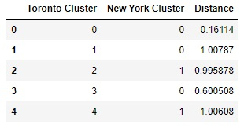

# The comparison of neighbourhoods in New York, Toronto and San Francisco

## Author: David Golob

## 1. Introduction

In this project we analyize the similarities between three cities: Toronto, New York and San Francisco. 
The purpose of the project is to determine which cities are more similar to each other.
The idea is that we obtain the data about venues in each of cities' neighbourhoods. Based on this data we can cluster neighbourhoods in each city, then
we can compare cluster centroids between each city and calculate similarity measure.

## 2. Data

The data used was compirsed of neigbourhood postal codes, neigbourhood names and neigbourhood latitude and longitude. Based on this data I was able
to obtain data for various venues in each neighborhoods. The venue data was then used in cluseter analysis.

The data for San Francisco postal codes, neighbourhoods and latitude and longitude was obtained on the following urls:

*https://www.geonames.org/postal-codes/US/CA/075/san-francisco.html*

*http://www.healthysf.org/bdi/outcomes/zipmap.htm*

The data for New York postal codes, neighbourhoods and latitude and longitude was obtained on the following url:

*https://cocl.us/new_york_dataset*

The data for Toronto postal codes, neighbourhoods and latitude and longitude was obtained on the following urls:

*https://en.wikipedia.org/wiki/List_of_postal_codes_of_Canada:_M*

*https://cocl.us/Geospatial_data*

The data for venus was obtained using Foursquare api.

## 3. Methodology

Once we have venue data for all the cities, we standardize the data so that all cities have the same venue types.
Then we calculate the percentage of presance of each venue type in each neighbourhood. This data is then used in
k-means clustering algorithm, where we use 5 clusters. After clusters for each city have been clculated, we take
cluster centers and clculate the similarity between different cities.
The algorithm for determination of most similar clusters is the following:

1. We pick the primary city and secondary city
2. For each cluster center for primary city we find the secondary city's cluster center that is the nearest (where we use euclidean distance)
3. We report the primary city's cluster centers, their nearest secondary city's cluster centers and the distance between the two

The distance between two cities is the sum of distances obtained in the previous algorithm where we have to take into acount that both cities need to be primary and secondary city once. 

## 4. Results

We get the following similarities between cities:

### 1. Toronto and San Francisco

**The distance between Toronto and San Francisco :** 5.3346 

### 2. Toronto and New York

**The distance between Toronto and New York :** 5.8688

### 3. New York and San Francisco

**The distance between New York and San Francisco :** 3.6641

## 5. Discussion

There is of course other possibilities of calucaltion of similarities between cities and we could also try different number of clusters.
But the results are never the less interesting.

## 6. Conclusion

The main coclusion is that the New York is more similar to San Francisco than to Toronto. Which is very similar because
Toronto and New York are geographically closer together and are both financial captials of their respective countries.